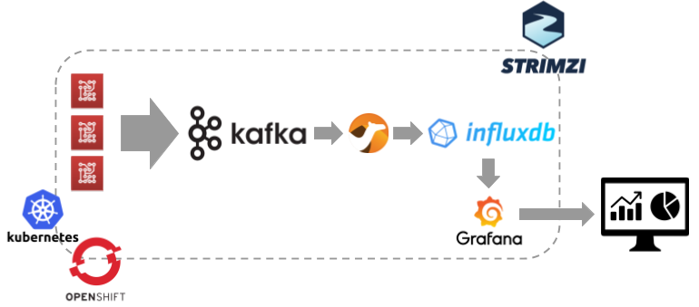

# Kafka IoT InfluxDB



## InfluxDB

### Start locally

The binaries can be downloaded from [https://portal.influxdata.com/downloads/](https://portal.influxdata.com/downloads/).

```
wget https://dl.influxdata.com/influxdb/releases/influxdb-1.7.4_linux_amd64.tar.gz
tar xvfz influxdb-1.7.4_linux_amd64.tar.gz
```

For starting the InfluxDB server.

```
cd influxdb-1.7.4-1
./usr/bin/influxd
```

### Creating a database

Connecting using the `influx` tool for creating a new database.

```
./usr/bin/influx

Connected to http://localhost:8086 version 1.7.4
InfluxDB shell version: 1.7.4
Enter an InfluxQL query
```

Create a `sensor` database.

```
> CREATE DATABASE sensor
> USE sensor
Using database sensor
```

For querying data on the `device-data` measurement (table).

```
SELECT "temperature", "humidity" FROM "device-data"
```

## Grafana

### Start locally

The binaries can be downloaded from [https://grafana.com/grafana/download](https://grafana.com/grafana/download).

```
wget https://dl.grafana.com/oss/release/grafana-6.0.0.linux-amd64.tar.gz
tar -zxvf grafana-6.0.0.linux-amd64.tar.gz
```

For starting the Grafana server.

```
cd grafana-6.0.0
./bin/grafana-server
```